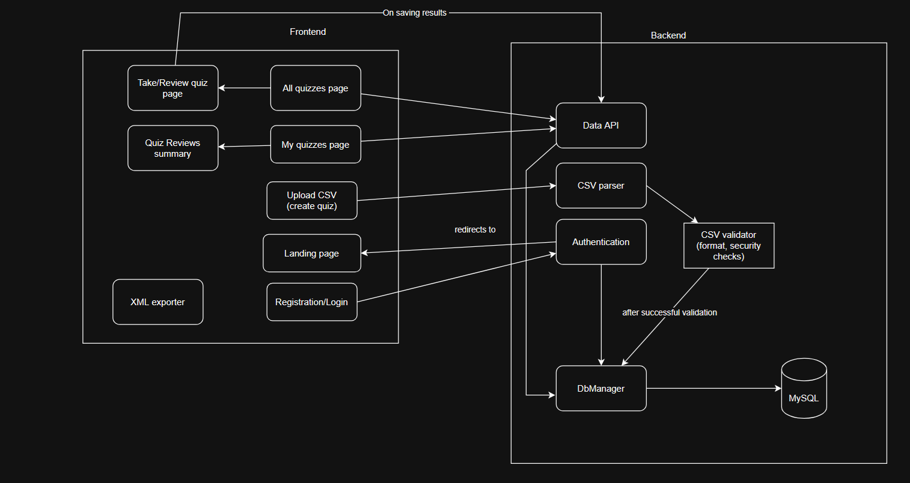

# Introduction
This project is for the Web programming course at Sofia University, Faculty of Mathematics and Informatics.

## Coding conventions:
- *Indentation*: 1tab (visually equals 4 spaces)
- *Bracket style*: K&R for frontend-side code, Allman for server-side code, 
- *File naming*: kebap-case (ex: registration-form)
- *Variable naming*: camelCase (ex: myQuizzesTable)

## Setup
- *Database*: Run the `create-database.sql` script. If you want to use different database credentials, edit the `database-configuration.ini` file. Currently default MySQL credentials with Xampp are used.
If you want to fill the db with some dummy data, run the `seed-database.sql` script. Inside, you can find two default users' credentials that you can use to check the app's functionality.
- *Configure https*: In order to not send password as plaintext in the registration/login, https must be used. Run the `configure-xampp-https.ps1` powershell script to achieve that.

## Design
Not all pages have their Figma design - it was mostly implemented in order to get a general idea of what the application should look like.
It can be accessed [here](https://www.figma.com/site/QVR3JwazaQ3xD0gLbTLOYN/Web?node-id=0-1&p=f&t=tl5Q09X6u8B8uJAv-0) .

Landing page             |  User quiz page
:-------------------------:|:-------------------------:
  |  

Color scheme chosen:

## Database schema
Below is a diagram of the database schema

## Architecture
Below is a diagram of the overall architecture
